## 기능 구현
### Req. 1-1 가상 머신 구성
Vagrant 설치하여 VM 2대 생성  
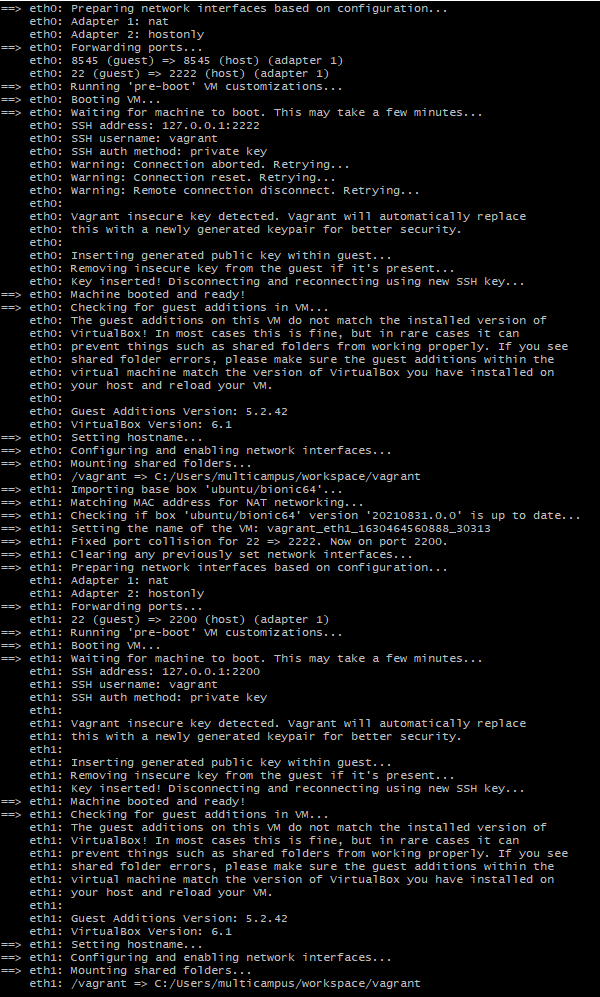

vagrant ssh를 통해 eth0에 접속 성공  
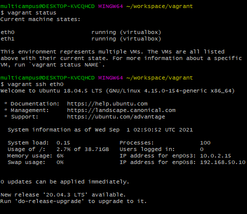

### Req. 1-2 이더리움 eth0 노드 구성
eth0에 Geth 설치  
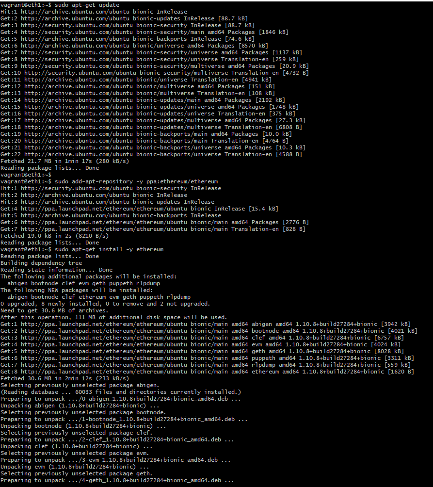

RPC 호출할 수 있도록 활성화
```sh
geth --networkid 921 --datadir data1 --nodiscover --port 30301 --rpc --rpcport "8545" --rpcaddr "0.0.0.0" --rpccorsdomain "*" --rpcapi "eth, net, web3, miner, debug, personal, rpc" --allow-insecure-unlock console
```

### Req. 1-3 이더리움 eth1 노드 구성
eth1에 마찬가지로 Geth 설치

### Req. 2-1 계정 생성
계정 생성  
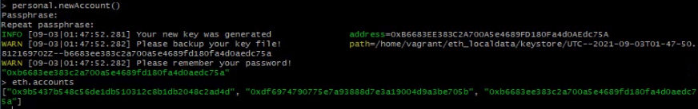

keystore 파일 확인  
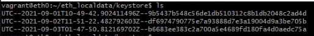

### Req. 2-2 코인베이스 설정
첫번째 계정을 코인베이스로 설정  
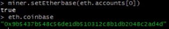

### Req. 2-3 마이닝(Mining) 시작
마이닝 진행 상태  
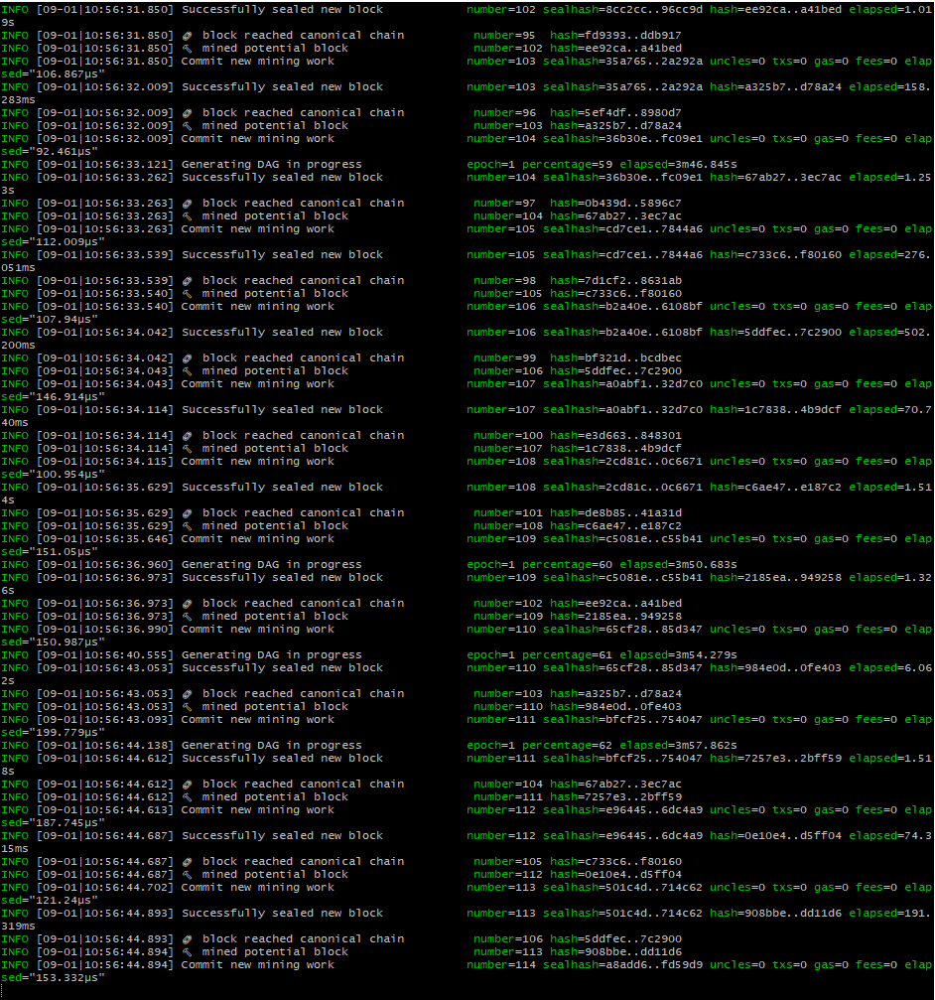


### Req. 2-4 마이닝 결과 확인

잔액 확인과 생성된 블록 수 조회 및 최신 블록의 상세 정보 조회  
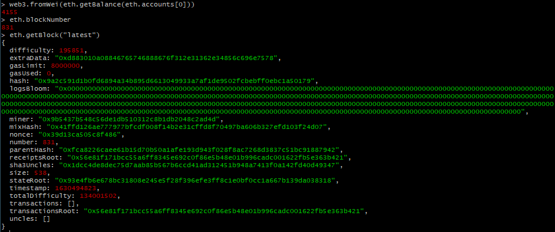


### Req. 3-1 트랜잭션 생성
트랜잭션 전송  
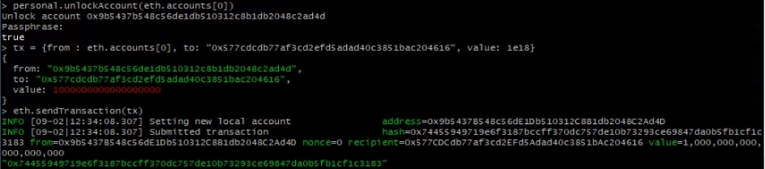

트랜잭션 상태 조회  
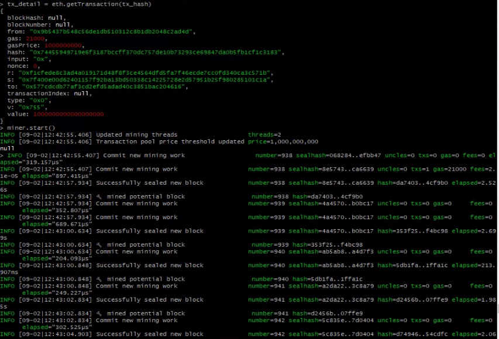

### Req. 3-2 트랜잭션 생성
마이닝 재시작 후 트랜잭션 상태 재조회  
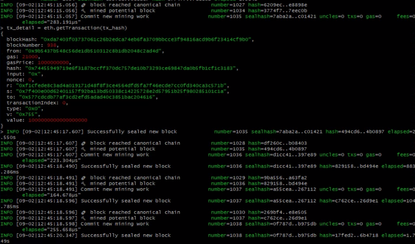

### Req. 4-1 eth0 노드 확인
포트 포워딩 확인  
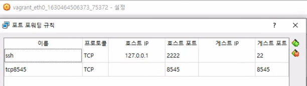

### Req. 4-2 Metamask 설정
Metamask RPC 옵션 설정  
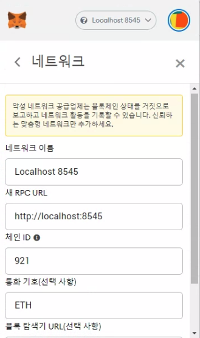

Metamask import된 계정 및 잔액 정보 확인  
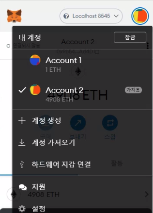


### Req. 4-3 스마트 컨트랙트 배포
Environment를 로컬 이더리움 네트워크와 연동 및 deploy 수행  
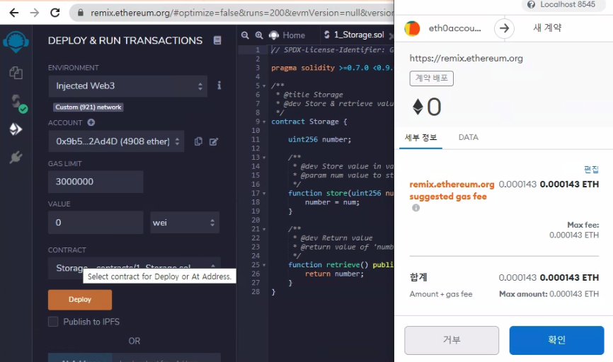

Deploy 수행 결과  
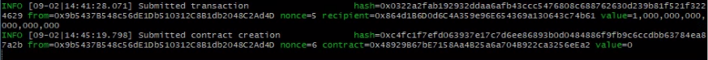


### Req 4-4 블록 정보 조회
스켈레톤 프로젝트 구동  
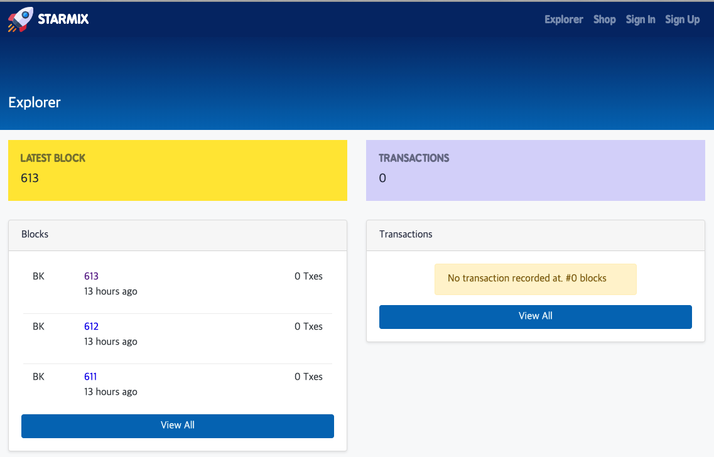

각 블록 및 트랜잭션 정보 확인  
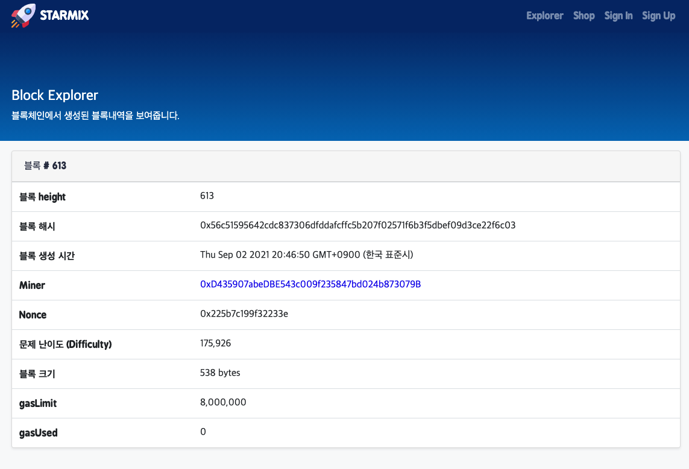


