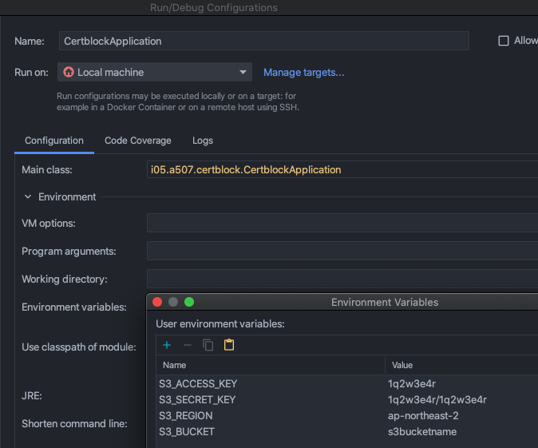

## AWS S3 사용을 위해 다음과 같은 환경변수 설정이 필요하다
```env
S3_ACCESS_KEY=1q2w3e4r
S3_SECRET_KEY=1q2w3e4r/1q2w3e4r
S3_REGION=ap-northeast-2
S3_BUCKET=s3bucketname
```

### IDE(IntelliJ)에서 환경변수 설정 방법
configuration에서 다음과 같이 설정할 수 있다.

