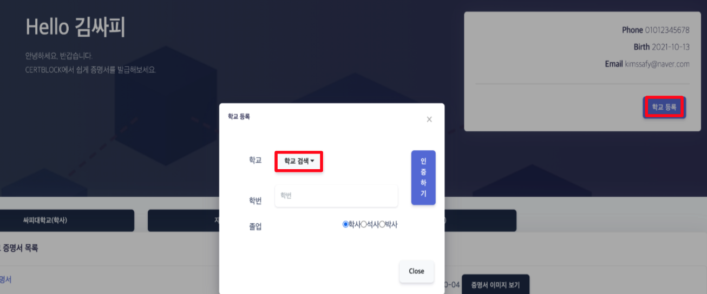

# 시연 시나리오

생성일: October 7, 2021 3:25 PM

## 1. 회원가입

- 우상단의 회원가입 버튼을 클릭한다.

- 이름, 전화번호, 생년월일을 입력 후 '문자 인증 받기 버튼을 클릭한다

- 입력한 핸드폰 번호로 받은 문자의 인증 번호를 입력하여 인증을 한다.

- 이메일과 비밀번호를 입력하여 회원가입을 완료한다.

## 2. 로그인

- 이메일과 비밀번호를 입력한 후 '로그인' 버튼을 클릭하여 로그인을 한다.

- 이메일과 비밀번호를 입력하여 로그인한다.

## 3. 학교 등록

- 학교 등록 버튼을 클릭하고, 학교 검색을 클릭한다.

- 학번 입력 후 '인증하기' 버튼을 클릭하여 학교 등록을 완료한다.

## 4. 증명서 발급 및 조회

- '발급 받기' 버튼을 클릭하여 증명서를 발급 받는다.

- '증명서 이미지 보기' 버튼을 클릭하여 발급 받은 증명서의 이미지를 볼 수 있다.

- 발급 받은 증명서의 이미지

## 5. 발급 기관(학교)의 발급 이력

- 발급 기관으로 로그인하여 발급 이력을 확인할 수 있다.

## 6. 증명서 제출

- '기업 회원' 버튼을 클릭하여 가상의 기업 채용 홈페이지를 띄운다.

- 'Certblock으로 증명서 제출' 버튼을 클릭한다.

- '증명서 불러오기' 버튼을 클릭한다.
- 제출을 원하는 증명서의 체크 박스에 체크하여 '제출하기' 버튼을 클릭한다.

- 제출되었음을 확인할 수 있다.

## 7. 기업의 증명서 수취 이력

- 기업 계정으로 로그인하여 해당 기업으로 제출된 증명서 이력을 확인할 수 있다.
